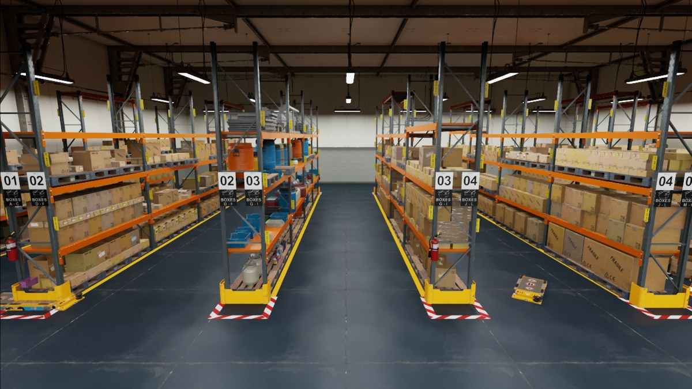
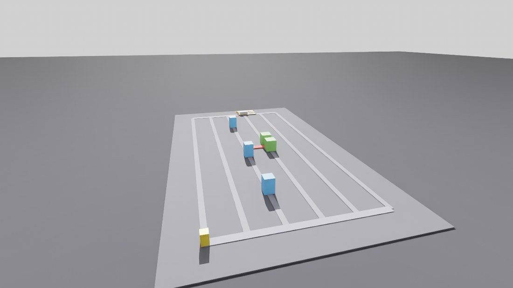
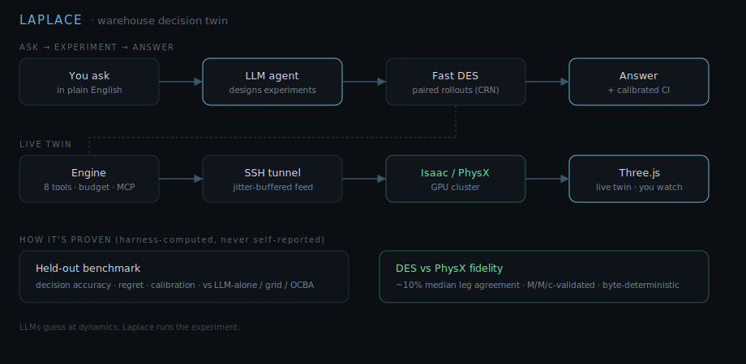

# Laplace

**An LLM agent that answers warehouse-operations questions by running experiments in a deterministic simulator and a live NVIDIA Isaac / PhysX digital twin, graded by a held-out, calibration-aware evaluation harness.**

<p align="center">
  <br>
  <sub>The warehouse twin rendered in NVIDIA Isaac Sim.</sub>
</p>

Ask a facility a question in plain English ("should we add a cross-aisle?", "how many robots does this pick zone need?") and get an evidence-backed answer instead of a hunch. An LLM agent designs and runs paired, common-random-number experiments inside a fast discrete-event simulator; the outcome plays back in a live 3D twin driven by real Isaac Sim / PhysX on a GPU cluster and streamed to the browser.

> **Thesis:** LLMs guess at dynamics. Laplace runs the experiment.

## See it move

<p align="center">
  <br>
  <sub>Live Isaac / PhysX replay of a rollout (full-quality clip below).</sub>
</p>

<p align="center">
  <video src="https://github.com/YuvrajPuyam/laplace/raw/main/docs/img/demo.mp4" controls muted width="720"></video>
</p>

If the player above does not load, watch the clip here: [docs/img/demo.mp4](docs/img/demo.mp4).

<p align="center">
  <br>
  <sub>The decision twin (Braess shortcut cell): pick (blue), pack (green), charge / dock (yellow) stations and an AMR.</sub>
</p>

## Architecture

<p align="center"></p>

| Area | What it is |
|------|-----------|
| `sim/` | Tier-0 discrete-event simulator (pure Python / NumPy), congestion + M/M/c station queueing, deterministic. |
| `engine/` | FastAPI service exposing the eight tools, episode lifecycle, budget ledger, the live relay + control channel, and an MCP server over the same handlers. |
| `agent/` | Claude tool-use loop and system prompt; emits a structured, source-traceable report. |
| `eval/` | Held-out scenarios, ground-truth sweep runner, baselines, calibration + metrics. |
| `ui/` | Single-file Three.js viewer: live twin, decision feed, config editor, pre-flight setup. |
| `renderer/` | Isaac Sim / PhysX headless replay + the live pose stream; the DES-vs-PhysX fidelity comparison. |
| `schemas/` | Frozen contracts (config, results, event log, tool API) shared by every consumer. |

## What it does

- **Ask in plain English.** An LLM agent turns an operational question into a set of configuration variants and tests them, using eight tools (propose config, run rollouts, compare, power-check, render, budget, report) behind a per-episode budget ledger.
- **Experiments, not vibes.** Comparisons use paired common random numbers so a layout change is measured against the same demand stream. No figure is ever reported without a traceable source.
- **Watch it happen.** A Three.js viewer shows the facility as a live 3D twin. The motion can be driven by a local kinematic model or by real NVIDIA Isaac Sim / PhysX running on a GPU cluster, reached over an SSH-tunnelled control channel, so an edit or a recommendation takes effect on the running twin.
- **Operate it live.** Nudge fleet size or demand, drag a station, add a lane, or type a command; the twin re-simulates and shows the impact with a before/after delta and a one-click accept or undo.

## Why it is trustworthy

The core of the project is measurement, not a demo.

- **Held-out benchmark.** Agent decisions are graded on known-optimum scenarios for decision accuracy, regret, and **calibration** (interval score and confidence-interval coverage), and ablated against LLM-alone, grid-search, and OCBA baselines.
- **Validated simulator.** The discrete-event core matches M/M/c queueing closed forms within tolerance, and every `(config, seed)` produces a byte-identical event log (common random numbers make paired comparisons sound).
- **Sim-to-physics fidelity.** To bound how far the cheap simulator can be trusted, it is validated against full Isaac / PhysX on the cluster: a typical per-leg travel time agrees within about **10%**, and the point where physical congestion makes the two diverge is measured, not assumed.
- **Reproducible.** 270+ automated tests, including the determinism and M/M/c validation gates.

## Quickstart

```bash
# install
pip install -e .

# run the test suite (determinism + M/M/c validation included)
make test

# bring up the live decision twin locally (viewer + engine + mock physics; no GPU needed)
make live          # then open http://127.0.0.1:8013/twin  and click "begin"
make live-down     # tear it down

# real Isaac / PhysX over an SSH tunnel to a GPU cluster
make live-gilbreth
```

See [`docs/LIVE_RUNBOOK.md`](docs/LIVE_RUNBOOK.md) for the live-twin runbook and [`docs/laplace-spec.md`](docs/laplace-spec.md) for the design spec.

## Tech

Python · NumPy · FastAPI · Model Context Protocol (MCP) · Claude Agent SDK · Three.js · NVIDIA Isaac Sim / PhysX · SLURM (Purdue Gilbreth GPU cluster).

## Status

Research prototype and portfolio project. The benchmark suite is held out; all agent development uses the dev scenarios. Sim-to-real validation (against physical facility data) is future work; the current fidelity claim is sim-to-physics (DES vs Isaac / PhysX).
