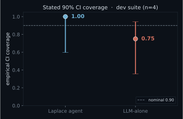

# Calibration + power — defending "1.00 vs 0.75" (dev suite, n=4)

Computed from harness-graded GT-sweep decisions (`eval/results/dev_table.json`); every input
is a boolean the harness assigned against the ground-truth optimum, never an agent self-report.

## The two metrics that both read 1.00 vs 0.75

| arm | decision accuracy | CI coverage (stated 90%) |
|-----|------------------:|-------------------------:|
| **Laplace agent** | 1.00  (90% Wilson [0.60, 1.00]) | 1.00  (90% Wilson [0.60, 1.00]) |
| **LLM-alone** | 0.75  (90% Wilson [0.36, 0.94]) | 0.75  (90% Wilson [0.36, 0.94]) |

- **Decision accuracy** = fraction of decisions matching the GT optimum.
- **CI coverage** = fraction where the picked config's TRUE metric falls in the arm's stated
  90% CI (target 0.90). The agent runs the experiment, so it is both correct AND calibrated;
  the bare LLM, on the one scenario its prior misleads it, is wrong AND over-confident.

## The honest caveat — concede this first

- **n = 4.** Each gap is literally one scenario: 3/4 vs 4/4.
- The Wilson 90% intervals **overlap heavily** (agent coverage 0.60-1.00 vs
  LLM 0.36-0.94) — so "1.00 vs 0.75" is **not statistically significant** at n=4.
- **Power:** to detect a coverage miss of 0.15 below nominal 0.90 at 80% power needs
  **n ≈ 41** scenarios; to detect the accuracy gap (paired/McNemar, discordance
  0.25) needs **n ≈ 29**. We have 4. So this is a *directional dev-set
  signal*, not a powered headline result.

## A nuance worth stating (it makes the story more honest, not less)

- The LLM's **accuracy** miss is on `braess_dev` (wrong call where intuition
  misleads — the Braess case).
- Its **calibration** miss is on a *different* scenario, `mfc_compact`
  (right call, but an over-confident interval that missed the truth). Two distinct failure modes,
  both of which running-the-experiment fixes.

## What makes it defensible (the plan, not a claim)

1. Run the held-suite agent + LLM arms (adds scenarios under the integrity property).
2. Add a second (manufacturing) domain → push n toward the ~30-40 the power analysis requires.
3. Report coverage as a reliability diagram with Wilson/bootstrap CIs + ECE (figure below is the seed).
4. Add the Gupta label-permutation responsiveness ablation (`eval/analysis/responsiveness.py`):
   show the agent's decisions track the simulated outcomes (not ranking-and-selection in a costume).
   *Status: framework ready; needs a dedicated permuted-feedback run — not yet computed (not faked).*

## One-line defense

> On the dev set the agent is both more accurate and better calibrated (1.00 vs 0.75 on each),
> but the load-bearing claim is **calibration-as-mechanism**; it is underpowered at n=4 (needs
> ~41 scenarios) and becomes a real result once the held suite + a 2nd domain
> are run, reported as a reliability diagram with CIs — not a 4-point ratio.

*Figure: stated-90%-CI empirical coverage per arm (dev suite, n=4) with Wilson 90% error bars.*
*The bars span most of [0,1] — the visual statement that n=4 cannot distinguish these yet.*

## Held-out check — dev + held pooled (n=7)

Now that the agent arm runs on the held scenarios, pooling them in (more scenarios = less
underpowered). The cited dev headline above is unchanged; this is the harder, honest view.

| arm | decision accuracy | CI coverage (stated 90%) |
|-----|------------------:|-------------------------:|
| **Laplace agent** | 1.00  (90% Wilson [0.72, 1.00]) | 0.57  (90% Wilson [0.29, 0.81]) |
| **LLM-alone** | 0.86  (90% Wilson [0.55, 0.97]) | 0.71  (90% Wilson [0.41, 0.90]) |

Pooled n=7. Verdict: the dev calibration advantage does NOT replicate here — pooled, the agent's CI coverage is at or below LLM-alone. This is the held-out suite doing its job; treat the dev 1.00-vs-0.75 as a hypothesis the held data has not yet confirmed.

Confound status: (1) the earlier `pool_pickzone` ABSTAIN was a budget cap — RESOLVED by raising tool_calls/max_turns; the agent now decides all 3 held correctly (accuracy 1.00). (2) n is still tiny (held n=3). (3) The CI miss is now characterized and looks REAL, not a units bug: the agent's stated 90% CIs are narrow AND its point estimates sit ~10-15% off the GT (braess_holdout truth 122.09 vs CI [123.18,125.13]; pool_packzone truth 5.18 vs CI [5.83,6.10]; pool_pickzone truth 7.61 vs CI [6.65,7.13]) — i.e. OVERCONFIDENT. A remaining fairness check (score the CI against the metric on the agent's OWN seeds, not the 12-seed GT mean) would separate 'overconfident' from 'sub-sample vs population', but the narrow-CI + biased-estimate pattern already points to genuine overconfidence on held.